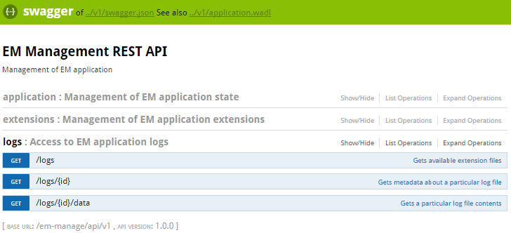

# emmanage-api-war
Java web module with REST services built using Jersey/Jackson/Swagger/Spring

## Overview

A Java web application module boilerplate that provides REST APIs using the following technologies:

* Jersey JAX-RS
* Jackson serialization
* Swagger annotation, Swagger UI
* Spring DI with annotation+programmatic configuration

## Prerequisites
1. Maven3 is required to build the application. It does not work with Maven2!
1. Java 1.8+

## Key concepts
1. Application Initialization
   * `emmanage.config.JerseyInitializer` setups Jersey as a server-side JAX RS implementation
   * `emmanage.config.SpringInitializer` setups spring content
1. Package layout
   * `emmanage.config` - configuration and initializers
   * `emmanage.model` - model classes for REST request/responses
   * `emmanage.rest` - rest resources and providers
   * `emmanage.service` - service interfaces used by rest resources
   * `emmanage.service.impl` - implservice interfaces used by rest resources
1. REST APIs
   * JAX-RS annotations are used in `emmanage.rest`
   * Swagger annotations are used to document the API
1. Swagger Integration
   * Runtime swagger generation configured in `emmanage.config.JerseyInitializer` 
   * Swagger UI taken from GIT with index.html simply modified to serve only local API
   * Root Swagger meta data configured in `emmanage.rest.SwaggerDefinitionProvider`
   * JAX-RS filter `emmanage.rest.SwaggerBaseUrlFilter` ensures that the swagger description always points a real URL of the running API  
1. WADL Support
   * provided OOTB by Jersey

## Quick Start
Start web application
```
mvn3 -Dem.baseDirectory=c:\cst\em\product jetty:run
```
Open [http://localhost:8090/em-manage/api](http://localhost:8090/em-manage/api) to see swagger documentation



Create war file suitable for app server deployment
```
mvn3 clean package
```
see `target/*.war`

## Docker support
### Setting up docker-machine to work well when behind proxy
If you are behind a proxy and would like play with a local docker-machine, create a new docker machine that will route all the traffic to a docker hub via the PROXY.

```
docker-machine create -d virtualbox --engine-env HTTP_PROXY=http://PROXY:8080 -engine-env PROXY=http://web-proxy.bbn.hpecorp.net:8080 --engine-env NO_PROXY=localhost,192.168.99.100 behind-proxy
```

And then setup your docker client using: 

```
docker-machine env behind-proxy
```
 
### Build docker image using maven
You can build a docker image named _em-manage_ using the https://github.com/spotify/docker-maven-plugin :

```
mvn3 clean package docker:build 
```

### Run a new docker container
To run a docker container to be accessible on port 8090 run:

```
docker stop em-manage
docker rm -f em-manage
docker run -d -p 8090:8080 --name em-manage em-manage 
```

Open your web browser at http://192.168.99.100:8090 , assuming that _192.168.99.100 is your docker host (`docker-machine ip behind-proxy`)

### Run a simple cluster
A simple cluster can be set using _docker-compose_ from the root directory of this project. If you are behind a proxy, set an environment variable _NO___PROXY_ to point to the docker host:

```
set NO_PROXY=192.168.99.100
```

Scale your application to 2 web nodes accessible through a proxy:

```
docker-compose stop
docker-compose scale web=2 proxy=1
```

Open your web browser at http://192.168.99.100 , assuming that _192.168.99.100 is your docker host (`docker-machine ip behind-proxy`)
