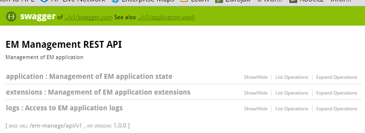

# emmanage-api-war
Java web module with REST services built using Jersey/Jackson/Swagger/Spring

## Overview

A boilerplate of a Java web application module for building REST apis. It 
utilizes the following technologies

* Jersey JAX-RS
* Jackson serialization
* Swagger annotation, Swagger UI
* Spring DI with annotation+programmatic configuration

## Prerequisites
1. Maven3 is required is build the application. It cannot be built with Maven2!
1. Java 1.8+

## Key concepts
1. Application Initialization
   * `emmanage.config.JerseyInitializer` setups Jersey as a server-side JAX RS implementation
   * `emmanage.config.SpringInitializer` setups spring content
1. Package layout
   * `emmanage.config` - configuration and initializers
   * `emmanage.model` - model classes for REST request/responses
   * `emmanage.rest` - rest resources and providers
   * `emmanage.service` - service interfaces used by rest resources
   * `emmanage.service.impl` - implservice interfaces used by rest resources
1. REST APIs
   * JAX-RS annotations are used in `emmanage.rest`
   * Swagger annotations are used to document the API
1. Swagger Integration
   * Runtime swagger generation configured in `emmanage.config.JerseyInitializer` 
   * Swagger UI taken from GIT with index.html simply modified to serve only local API
   * Root Swagger meta data configured in `emmanage.rest.SwaggerDefinitionProvider`
   * JAX-RS filter `emmanage.rest.SwaggerBaseUrlFilter` ensures that the swagger description always points a real URL of the running API  
1. WADL Support
   * provided OOTB by Jersey

## Quick Start
Start web application
```
mvn3 -Dem.baseDirectory=c:\cst\em\product jetty:run
```
Open [http://localhost:8090/emmanage/api/v1](http://localhost:8090/emmanage/api/v1) to see swagger documentation



Create war file suitable for app server deployment
```
mvn3 clean package
```
see `target/*.war`
